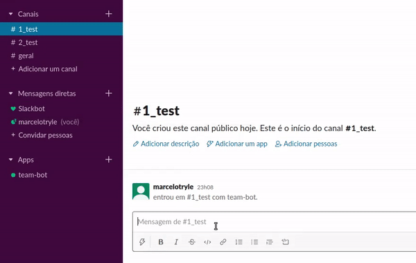

<div align="center">
    
</div>
<h1 align="center">Team Slack Bot</h1>

<p align="center">
    <a href="https://nodei.co/npm/dotenv/"></a>
    <a href="https://nodei.co/npm/botkit/"></a>
    <a href="https://nodei.co/npm/node/"></a>
</p>

<p align="center">
    Let your team focus on productivity!
</p>

## About

This repository contains a [Slack](https://slack.com/) bot with simple commands
implemented. For now, they are:

- `/team-add`: which adds members to a channel team.
- `/team-sort`: which shuffles the team members from a channel.

To us, we have a single team for each channel.

## Getting started

First, we need to install the following:

- [ngrok](https://ngrok.com/)
- [Node.js](https://nodejs.org/en/)

Then, we need to set all your environment variables. Luckily, we already have a
model with everything we need. Just rename the `env` file into `.env` and update
the variable values based on your Slack bot.

After that, you can clone this project and install the dependency packages:

```bash
git clone https://github.com/Kludex/team-slack-bot
cd team-slack-bot
npm install -d
```

## Usage

We'll only use `ngrok` and `node` for running purposes.

### Run ngrok

`ngrok` is an awesome service that I recommend to read about if you have time.
Basically, `ngrok` exposes local servers behind NATs and firewalls to the public
internet over secure tunnels. Which is really useful to test our applications.

```bash
./ngrok http 8765
```

### Run node

```bash
node index.js
```

## Contribute

Pull requests are welcome. For major changes, please open an issue first to
discuss what you would like to change.
